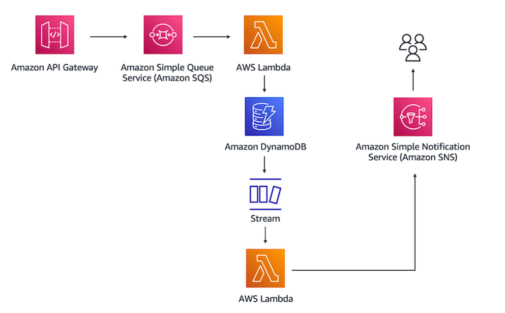

# AWS-website-solution
# Serverless Event-Driven Order Processing Backend

## 📝 Project Overview
This repository contains the code and configuration files for a fully decoupled, event-driven serverless architecture built on AWS. 

The system acts as a proof-of-concept for a high-demand retail backend. It is designed to ingest customer orders, gracefully handle sudden spikes in website traffic without overloading the database, and automatically notify stakeholders of new entries—all with zero server management.

This project was built as hands-on practice while preparing for the **AWS Certified Solutions Architect – Professional** certification.

## Architecture Flow

 

1. **API Gateway:** Acts as the REST API entry point, securely receiving `POST` requests containing order data.
2. **Amazon SQS:** API Gateway passes the payload directly into an SQS queue. This decouples the ingestion layer from the processing layer, acting as a buffer during traffic surges.
3. **AWS Lambda (Processor):** A Lambda function polls the SQS queue, processes the messages, and writes the records into a DynamoDB table.
4. **Amazon DynamoDB & Streams:** Stores the order data. DynamoDB Streams captures the `INSERT` event in real-time.
5. **AWS Lambda (Notifier):** A second Lambda function is triggered by the DynamoDB Stream. It extracts the new record and publishes it to an SNS topic.
6. **Amazon SNS:** Pushes an email notification to subscribed users alerting them of the new order.

## AWS Services Utilized
* **Compute:** AWS Lambda (Python 3.9)
* **Storage/Database:** Amazon DynamoDB
* **Integration & Messaging:** Amazon API Gateway, Amazon SQS, Amazon SNS, DynamoDB Streams
* **Security:** AWS Identity and Access Management (IAM)

## Repository Structure

* `/src` - Contains the Python code for the Lambda functions.
  * `poc-lambda-1.py` - Reads from SQS and writes to DynamoDB.
  * `poc-lambda-2.py` - Triggered by DynamoDB Streams and publishes to SNS.
* `/iam-policies` - Contains the custom JSON policies adhering to the principle of least privilege.
* `/api-gateway` - Contains the JSON mapping templates used to format requests directly to SQS.

## Deployment (ClickOps)
Currently, this architecture is provisioned manually via the AWS Management Console in the `us-east-1` region. 

**High-Level Steps:**
1. Create custom IAM policies and roles for API Gateway and Lambda.
2. Provision a DynamoDB table (`orders`) with a Partition Key (`orderID`) and enable DynamoDB Streams.
3. Create an SQS Queue (`POC-Queue`) and configure access policies.
4. Deploy the first Lambda function, attach the SQS trigger, and map it to DynamoDB.
5. Create an SNS topic and subscribe an email address.
6. Deploy the second Lambda function, attach the DynamoDB Stream trigger, and map it to SNS.
7. Build a REST API in API Gateway with a `POST` method integrated directly with SQS using a VTL mapping template.

## Key Takeaways
* **Asynchronous Decoupling:** Placing SQS between the API and the database ensures no data is lost during traffic spikes and prevents database throttling.
* **Least Privilege:** Granular IAM roles were created for each individual service interaction rather than using broad, pre-existing admin access.
* **Event-Driven Execution:** Utilizing DynamoDB streams allows for secondary actions (notifications) to occur reactively without adding latency or complex logic to the primary database write function.

